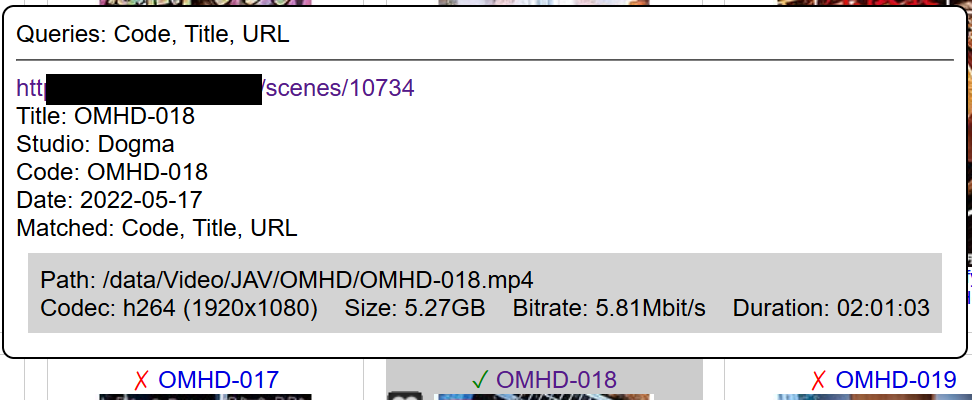
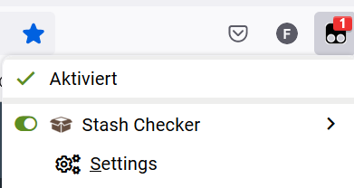
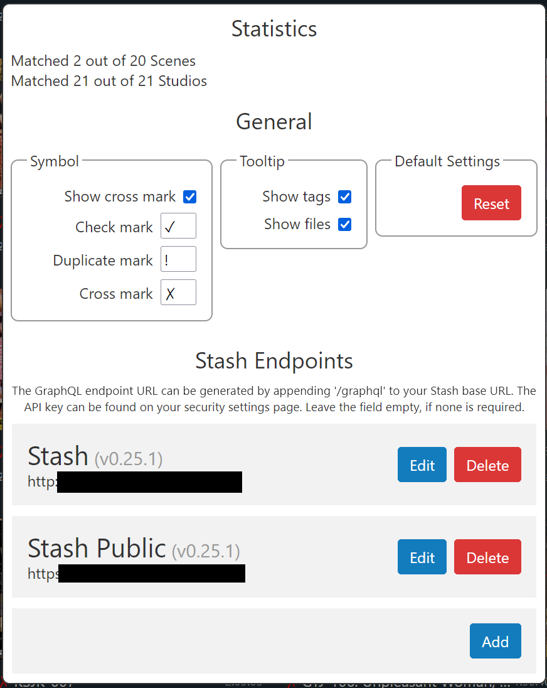

# Stash Checker

Stash Checker is an userscript for porn websites to check if a Scene/Performer is in your [Stash](https://github.com/stashapp/stash) instance.
It shows a checkmark if an item was found in your Stash.
Hovering over the checkmark gives you a tooltip with information about the item in your Stash.

## Features

- A tooltip for matched entries including basic metadata and a link to the entry
- Supported websites: StashDB, TPDB, IAFD, JabLibrary and many more (see `@match` section in the userscript; go [here](https://github.com/timo95/stash-checker/issues/5) to request more)
- Many different types of entries: Scene, Performer, Movie, Gallery, Studio and Tag (not yet supported by Stash)
- Match entries by: StashId, URL, Studio Code, Name and Title
- Multiple Stash endpoints
- Dark mode (check your browser preferences)

## Installation

You need a browser plugin like [Tampermonkey](https://www.tampermonkey.net/) to run userscripts.

The newest release of Stash Checker can be found in the release section to the right.
Opening `index.prod.user.js` under `Assets` should prompt Tampermonkey to install the script.

It also gets deployed to [this Gist](https://gist.github.com/timo95/562b9363d491e3ee281cb46944445fcd).
Click on the `Raw` button to import the script to Tampermonkey.

## Settings

Settings can be opened using the Tampermonkey dropdown menu.

Here you can edit the Stash URL and API key or add another Stash endpoint.

## Stash version compatibility

At the moment only the newest Stash versions are supported.
For backwards compatibility, see this [feature request](https://github.com/timo95/stash-checker/issues/9).

## Matching

Most entries get matched to your Stash by their URL.
Some websites also support matching by title or studio code.
The tooltip lists all fields used for matching and which ones successfully matched to the Stash entry.

All instances of Stash-box only match by stashId.

## Development

See [here](docs/DEVELOPMENT.md).
